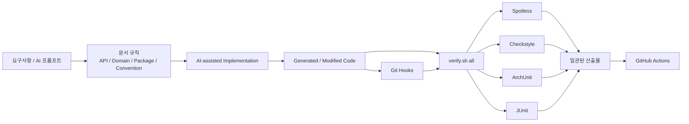
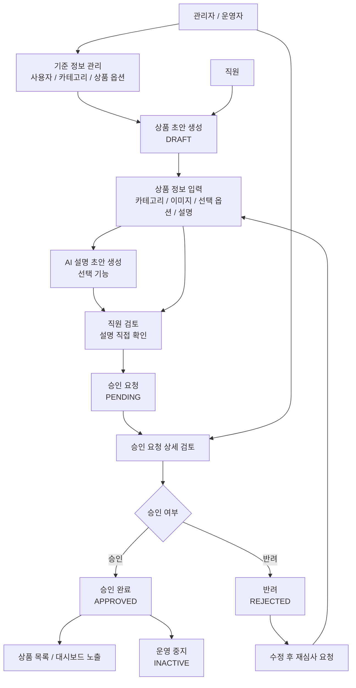
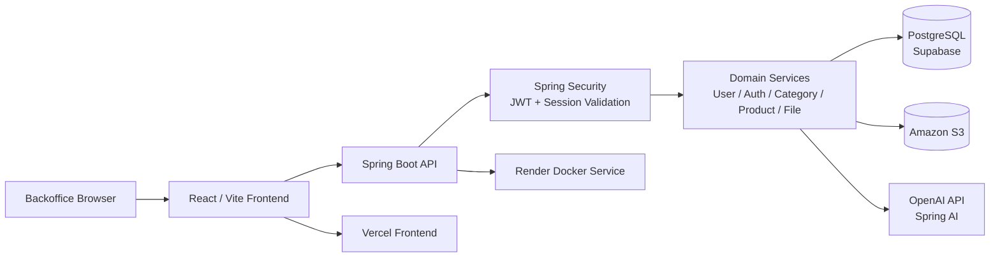
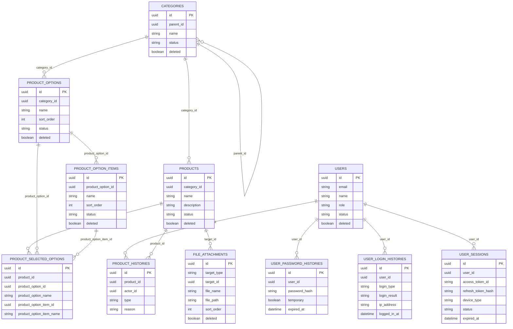

# Guardrail Backoffice


Guardrail Backoffice는 AI를 활용한 개발 환경에서 발생하는 산출물의 비일관성을 줄이기 위해 만든 하네스 엔지니어링 실험 프로젝트입니다.

같은 요구사항과 프롬프트를 사용해도 팀원마다 다른 패키지 구조, API 응답 형식, 도메인 규칙, 예외 처리 방식이 생성되는 문제를 겪었고, 이를 문서화된 규칙과 자동 검증 도구로 통제하는 방식을 검증하기 위해 커머스 백오피스 도메인을 구현 대상으로 선택했습니다.

### Test Account
```
admin@guardrail.com
admin1234!
```

## 문제 정의

AI를 개발에 활용하면 구현 속도는 빨라지지만, 검증 장치가 약하면 다음 문제가 반복됩니다.

- 같은 요구사항을 입력해도 패키지 구조와 계층 책임이 달라집니다.
- API 응답 형식, 예외 처리, DTO/Entity 사용 방식이 일관되지 않습니다.
- 권한 검증, 상태 전이, 이력 저장 같은 업무 규칙이 누락됩니다.
- 사람이 매번 산출물을 다시 검토하고 수정해야 하므로 재작업 비용이 커집니다.
- 팀원이 각자 다른 방식으로 AI를 사용하면 프로젝트 전체 규칙이 쉽게 무너집니다.

## 프로젝트 목표

Guardrail의 목표는 AI를 사용하지 않는 것이 아니라, AI를 활용하여 만든 산출물을 프로젝트 규칙 안으로 통제하는 것입니다.

- 문서를 단순 참고 자료가 아니라 구현 기준으로 사용합니다.
- 패키지 구조, API 계약, 도메인 규칙, 코드 컨벤션을 먼저 정의합니다.
- ArchUnit, Checkstyle, Spotless, JUnit, Git hook, GitHub Actions로 규칙 위반을 차단합니다.
- 커머스 백오피스 도메인은 하네스가 실제 유스케이스에도 적용 가능한지 검증하기 위한 구현 대상입니다.

## 하네스 설계

| 하네스 | 역할 | 구현 |
| --- | --- | --- |
| 문서 하네스 | 구현 전 기준 정의 | `docs/*.md`, `docs/domains/*.md`, `AGENT.md` |
| 구조 하네스 | 패키지, 계층, 엔티티 규칙 차단 | ArchUnit |
| 스타일 하네스 | 포맷, import, Javadoc, `@Data` 사용 금지 | Spotless, Checkstyle |
| 비즈니스 하네스 | 상태 전이, 권한, 이력, 파일 정책 검증 | JUnit |
| 실행 하네스 | 검증 명령 단일화 | `./scripts/verify.sh all` |
| 협업 하네스 | 커밋/푸시 전 검증 | `.githooks` |
| CI 하네스 | 로컬 우회 방지 | GitHub Actions |

## 하네스 흐름



## 검증 대상 유스케이스

커머스 백오피스는 하네스 적용을 검증하기 위한 현실적인 구현 대상입니다.

| 영역 | 검증한 규칙 |
| --- | --- |
| 사용자/인증 | 사용자 생성, 임시 비밀번호, 로그인, 토큰 재발급, 세션 상태, 본인/관리자 권한 |
| 기준 정보 | 카테고리 트리, 순환 parent 방지, 상품 옵션 그룹/옵션값 관리 |
| 상품 등록 | 초안 생성, 선택 옵션 스냅샷, 이미지 메타데이터 연결 |
| AI 보조 | OpenAI 설명 초안 생성, 생성 결과 직접 확정 금지, 승인 전 직원 검토 |
| 승인 관리 | `DRAFT -> PENDING -> APPROVED/REJECTED`, 반려 후 재제출, 승인 상품 비활성화 |
| 파일 관리 | S3 업로드, 상품 소유자 검증, 승인 완료 상품 파일 변경 제한 |

## 백오피스 흐름

1. 관리자 또는 운영자가 사용자, 카테고리, 상품 옵션 기준 정보를 관리합니다.
2. 직원은 상품 초안을 생성하고 카테고리, 이미지, 선택 옵션, 설명을 입력합니다.
3. 필요하면 OpenAI 기반 AI 설명 초안을 생성해 상품 설명에 반영합니다.
4. 직원은 상품을 승인 대기 상태로 제출합니다.
5. 관리자 또는 운영자는 승인 요청 상세에서 승인 또는 반려합니다.
6. 승인 완료 상품은 상품 목록과 대시보드에 노출됩니다.



## 서비스 아키텍처



## ERD

엔티티는 JPA 객체 연관관계 대신 UUID 식별자 값으로 참조합니다. 아래 다이어그램은 실제 FK 매핑이 아니라 하네스 검증 대상 도메인의 논리 참조 관계를 나타냅니다. 상세 DDL은 `docs/db/*.sql`에서 관리합니다.



## 기술 스택

### Backend

| 영역 | 기술 | 버전 |
| --- | --- | --- |
| Language | Java | 21 |
| Build Tool | Gradle | 8.14.4 |
| Framework | Spring Boot | 3.5.13 |
| Dependency Management | Spring Dependency Management Plugin | 1.1.7 |
| Persistence | Spring Data JPA | Spring Boot 3.5.13 BOM 관리 |
| Security | Spring Security | Spring Boot 3.5.13 BOM 관리 |
| Validation | Spring Validation | Spring Boot 3.5.13 BOM 관리 |
| AI | Spring AI BOM | 1.1.5 |
| OpenAI | spring-ai-starter-model-openai | Spring AI 1.1.5 BOM 관리 |
| Storage | AWS SDK S3 | AWS SDK BOM 2.31.54 |
| API Docs | Springdoc OpenAPI WebMVC UI | 2.8.17 |
| JWT | JJWT | 0.13.0 |
| Query | Querydsl JPA/APT | 6.10.1 |
| Architecture Test | ArchUnit JUnit5 | 1.4.1 |
| Formatter | Spotless Gradle Plugin | 7.2.1 |
| Formatter Engine | google-java-format | 1.28.0 |
| Static Analysis | Checkstyle | 10.26.1 |
| Production DB Driver | PostgreSQL JDBC | Spring Boot 3.5.13 BOM 관리 |
| Test DB | H2 | Spring Boot 3.5.13 BOM 관리 |

### Frontend

프론트엔드 버전은 `frontend/package-lock.json` 기준입니다.

| 영역 | 기술 | 버전 |
| --- | --- | --- |
| Runtime | Node.js | 20 이상 권장 |
| Local Verified Runtime | Node.js | 22.14.0 |
| Package Manager | npm | 10.9.2 |
| Framework | React | 18.3.1 |
| DOM Renderer | React DOM | 18.3.1 |
| Router | React Router DOM | 7.14.2 |
| Server State | TanStack React Query | 5.100.6 |
| HTTP Client | Axios | 1.15.2 |
| Form | React Hook Form | 7.74.0 |
| Form Resolver | @hookform/resolvers | 3.10.0 |
| Schema Validation | Zod | 3.25.76 |
| Build Tool | Vite | 6.4.2 |
| Vite React Plugin | @vitejs/plugin-react | 4.7.0 |
| Language | TypeScript | 5.9.3 |
| Styling | Tailwind CSS | 3.4.19 |
| CSS Processor | PostCSS | 8.5.12 |
| CSS Prefixer | Autoprefixer | 10.5.0 |

### Runtime / Deploy

| 영역 | 기술 | 버전 또는 기준 |
| --- | --- | --- |
| Backend Build Image | gradle | 8.14.4-jdk21 |
| Backend Runtime Image | eclipse-temurin | 21-jre |
| Backend Hosting | Render Web Service | Docker |
| Frontend Hosting | Vercel | Root Directory `frontend` |
| CI | GitHub Actions | `actions/checkout@v4`, `actions/setup-java@v4` |

## 저장소 구조

```text
.
├── src/main/java/com/hyeon/guardrail
│   ├── auth
│   ├── category
│   ├── common
│   ├── file
│   ├── product
│   ├── productoption
│   └── user
├── src/test/java/com/hyeon/guardrail
├── frontend
├── docs
│   ├── domains
│   └── db
├── scripts
├── config/checkstyle
├── .githooks
├── .github/workflows
└── Dockerfile.backend
```

## 백엔드 실행

`application.yml`은 저장소에 커밋하지 않습니다. 로컬과 CI는 예시 파일을 복사해서 사용합니다.

```bash
cp src/main/resources/application-example.yml src/main/resources/application.yml
./gradlew bootRun
```

실제 운영 값은 다음처럼 외부에서 주입합니다.

```bash
SPRING_CONFIG_ADDITIONAL_LOCATION=/etc/secrets/application.yml
```

필수 설정은 `application-example.yml`을 기준으로 채웁니다.

| 설정 | 설명 |
| --- | --- |
| `spring.datasource.*` | PostgreSQL 연결 정보 |
| `jwt.secret-key` | JWT 서명 키 |
| `spring.ai.openai.api-key` | OpenAI API 키 |
| `app.storage.s3.*` | S3 버킷, 리전, 접근 키, 공개 URL |
| `app.cors.allowed-origins` | 프론트엔드 허용 Origin |

## 프론트엔드 실행

```bash
cd frontend
npm install
npm run dev
```

프론트엔드 환경 변수는 `frontend/.env` 또는 배포 플랫폼 환경 변수로 관리합니다.

```env
VITE_API_BASE_URL=http://localhost:8080
VITE_APP_NAME=Guardrail Backoffice
```

배포 환경에서는 `VITE_API_BASE_URL`을 Render 백엔드 URL로 설정합니다.

## 검증

백엔드 전체 하네스 검증은 다음 명령으로 실행합니다.

```bash
./scripts/verify.sh all
```

포함 항목은 다음과 같습니다.

- Spotless 포맷 검증
- Checkstyle 정적 규칙 검증
- JUnit 테스트
- ArchUnit 아키텍처 규칙 검증

프론트엔드 빌드 검증은 별도로 실행합니다.

```bash
cd frontend
npm run build
```

Git hook 설치:

```bash
./scripts/install-git-hooks.sh
```

## 하네스 문서

이 프로젝트는 문서를 단순 참고 자료가 아니라 구현 규칙으로 사용합니다. 새 기능을 추가할 때는 아래 문서를 먼저 확인하고, 코드와 문서가 동시에 맞아야 합니다.

| 문서 | 목적 |
| --- | --- |
| `docs/PROJECT-OVERVIEW.md` | 프로젝트 목적과 핵심 워크플로우 |
| `docs/API-SPEC.md` | REST API 계약 |
| `docs/DOMAIN-MODEL.md` | 도메인 관계와 핵심 모델 |
| `docs/PACKAGE-STRUCTURE.md` | 패키지 구조 규칙 |
| `docs/CODE-CONVENTIONS.md` | Java 코드 작성 규칙 |
| `docs/HARNESS-RULES.md` | 자동 검증 하네스 규칙 |
| `docs/HOOKS-RUNBOOK.md` | Git hook 및 검증 운영 방법 |
| `docs/domains/*.md` | 도메인별 상세 규칙 |
| `docs/db/*.sql` | Supabase/PostgreSQL 기준 DDL |

## 아키텍처 규칙

주요 규칙은 테스트와 Checkstyle로 차단합니다.

- Controller는 Repository에 직접 접근하지 않습니다.
- Controller는 Domain Entity에 직접 의존하지 않습니다.
- Repository는 상위 계층에 의존하지 않습니다.
- API는 `/api/v1` prefix를 사용합니다.
- 응답은 공통 응답 포맷을 사용합니다.
- Entity는 `BaseEntity` 또는 `SoftDeleteEntity`를 상속합니다.
- JPA 연관관계 매핑은 사용하지 않고 ID 기반 참조를 사용합니다.
- `@Data`는 사용하지 않습니다.
- Java public API에는 Javadoc을 작성합니다.

## 배포

### Backend / Render

Render는 Docker Web Service로 배포합니다.

- Dockerfile: `Dockerfile.backend`
- Exposed port: `8080`
- 운영 설정: Render Secret File 또는 Environment Variable
- Secret file 사용 시:

```env
SPRING_CONFIG_ADDITIONAL_LOCATION=/etc/secrets/application.yml
```

### Frontend / Vercel

Vercel은 모노레포에서 프론트엔드만 빌드합니다.

- Root Directory: `frontend`
- Build Command: `npm run build`
- Output Directory: `dist`
- Environment Variable: `VITE_API_BASE_URL`

백엔드 코드 변경만으로 Vercel이 재배포되지 않도록 Vercel Root Directory와 Ignored Build Step 설정을 함께 관리합니다.

## GitHub Actions

현재 workflow는 두 가지입니다.

| Workflow | 목적 |
| --- | --- |
| `.github/workflows/verify.yml` | 백엔드 하네스 검증 |
| `.github/workflows/keep-render-awake.yml` | Render health check workflow |

`verify.yml`은 저장소에 `application.yml`을 올리지 않기 위해 `application-example.yml`을 복사해 검증용 설정으로 사용합니다.

## 버전 정책

현재 프로젝트 버전은 `1.0.3`입니다.

버전 변경 기준은 `docs/VERSION-POLICY.md`를 따릅니다.

- `PATCH`: 버그 수정, 문서 최신화, 내부 리팩토링
- `MINOR`: 하위 호환 기능 추가
- `MAJOR`: API 또는 도메인 계약 변경

변경 내역은 `CHANGELOG.md`에 기록합니다.

## 커밋 메시지

커밋 메시지는 `docs/COMMIT-MESSAGE.md`를 따릅니다.

예시:

```text
docs: 루트 README 작성
```
